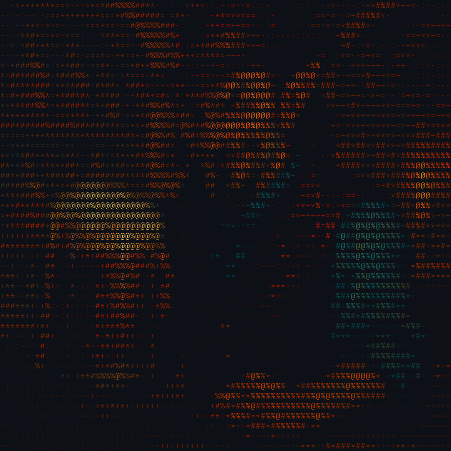

# halftone

[](https://crates.io/crates/halftone)

Turn images into ANSI/ASCII art, right in your terminal.

`halftone` converts any image to a colored (or monochrome) character-art
rendering, using histogram equalization and Floyd-Steinberg dithering to
preserve detail that naive brightness-to-glyph mapping throws away. It can
also generate the source image for you from a text prompt via OpenAI's
`gpt-image-1`, so you can go from an idea to terminal art in one command.



## Features

- **Detail-preserving conversion** — histogram equalization spreads out
  clustered midtones instead of collapsing them into one or two glyphs, and
  Floyd-Steinberg dithering fakes far more tonal range than the glyph ramp
  actually has, so fine structure survives instead of blobbing out.
- **Correct terminal proportions** — corrects for terminal cells being
  roughly twice as tall as they are wide, so output isn't vertically
  stretched.
- **True color output** — each glyph is colored with its cell's actual
  sampled RGB, so hue differences that share a luminance (green skin vs. tan
  leather vs. brown wood) don't get flattened away. `--mono` gives you plain
  grayscale ASCII instead.
- **Text-to-art generation** — skip the source image entirely and describe
  what you want; `halftone generate` calls OpenAI's image API and pipes the
  result straight into the same conversion pipeline.
- **PNG/JPG export** — save the art as an actual raster image (rendered with
  a bundled monospace font) instead of just a text/ANSI dump, so it's easy
  to share somewhere that doesn't render terminal escape codes.

## Install

Requires a [Rust toolchain](https://rustup.rs/).

```sh
cargo install halftone
```

Or build from source:

```sh
git clone https://github.com/devonoel/halftone.git
cd halftone
cargo build --release
```

The binary will be at `target/release/halftone`.

## Usage

### Convert an existing image

```sh
halftone convert path/to/image.png
```

### Generate an image from a prompt, then convert it

```sh
export OPENAI_API_KEY=sk-...
halftone generate "a neon-lit alley cat in the rain" --size landscape
```

### Generate a batch of variations from one prompt

```sh
halftone generate "a neon-lit alley cat in the rain" --count 4 --out cat.png
# -> cat-1.png, cat-2.png, cat-3.png, cat-4.png
```

### Options

Available on both `convert` and `generate`:

| Flag             | Description                                      | Default |
| ---------------- | ------------------------------------------------- | ------- |
| `--width <N>`     | Output width in characters                        | `80`    |
| `--out <path>`    | Write output to a file (also prints to stdout)     | —       |
| `--mono`          | Emit plain grayscale ASCII instead of ANSI color   | off     |
| `--bg <spec>`     | Background color for image exports                | `auto`  |

`--out` accepts either a text path (`.txt`, `.ansi`, or anything else) to
save the raw ANSI/ASCII text, or an image path (`.png`, `.jpg`/`.jpeg`,
`.bmp`, `.tiff`, `.webp`) to save a rasterized image of the art instead —
the format is picked automatically from the extension. Either way, the
colored/mono art is still printed to stdout. `--bg` only affects image
exports — text/ANSI output has no background of its own, it just takes on
whatever your terminal is set to. By default (`auto`) the background is
derived from the source image's own average color, darkened, so the export
reads as a natural dark theme tinted to the image rather than flat black.
Pass a hex color like `--bg 1e2b30` to pick one explicitly.

`--bg` also accepts:

- `transparent` — drop the background entirely, so only the glyphs
  themselves are opaque. Useful for compositing the art over a slide, web
  page, or another image. PNG output only (`.jpg`/`.bmp`/`.tiff` have no
  alpha channel to hold it, and are rejected with an error rather than
  silently flattening to black).
- `<auto|hex>@<0-255>` — a semi-transparent tinted background, e.g.
  `auto@128` or `1e2b30@80`. A backdrop still shows through at the given
  opacity for contrast, without hiding whatever the art gets composited
  onto. Also PNG output only.

Note that the color pipeline (equalization, saturation, the tuned background)
is built around dark backgrounds and colorful source images — glyph colors
are chosen to read well against a dark backdrop specifically, so
`transparent`/translucent exports composited onto a light background may
look washed out or low-contrast. There's no great fix for this today short
of `--mono`; it's a known limitation of exporting colored glyphs without a
guaranteed backdrop.

`generate` only:

| Flag                  | Description                                              | Default  |
| --------------------- | ---------------------------------------------------------- | -------- |
| `--size <shape>`       | `square` (1024x1024), `landscape` (1536x1024), or `portrait` (1024x1536) | `square` |
| `--save-image <path>`  | Also save the raw generated image, before conversion       | —        |
| `-n, --count <N>`      | Generate this many images from the same prompt (1-10)      | `1`      |

`--count` asks OpenAI for all `N` images in a single request rather than
making `N` separate calls. When `--count` is greater than 1, `--out` and
`--save-image` each get a `-1`, `-2`, ... suffix inserted before their
extension (`art.png` → `art-1.png`, `art-2.png`, ...) so every image in the
batch lands at its own path instead of the last one overwriting the rest.

OpenAI caps how many images an account can request per minute, and that cap
varies by account/usage tier -- if `--count` asks for more than yours
allows, halftone automatically retries in smaller batches (and waits a bit
between requests if the account's per-minute window needs to refill),
rather than failing the whole command.

## How it works

1. The source image is resized directly to the target character grid
   (`width` × the aspect-corrected `height`), letting the resize filter do
   the per-cell averaging.
2. Each cell's luminance is computed (Rec. 709 weights) and remapped through
   the image's own cumulative luminance distribution — an equalization step
   that spreads out narrow midtone clusters instead of leaving them crushed
   into a couple of glyphs.
3. Equalized values are quantized to the glyph ramp (`` .:-=+*#%@``) with
   Floyd-Steinberg error diffusion, the same trick offset-printing halftones
   use to fake tone levels beyond what the ink (or in this case, the glyph
   ramp) actually offers.
4. Unless `--mono` is set, each glyph is wrapped in a 24-bit ANSI color
   escape using that cell's sampled RGB.
5. If `--out` points at an image file, the same glyph grid is instead
   rasterized onto a canvas using a bundled copy of JetBrains Mono, one
   fixed-size cell per glyph, rather than being formatted as ANSI text.

## Requirements

- `OPENAI_API_KEY` environment variable, only for `generate`.
- A true-color-capable terminal to see ANSI output as intended (most modern
  terminal emulators qualify).

PNG/JPG export bundles [JetBrains Mono](https://github.com/JetBrains/JetBrainsMono)
(SIL Open Font License 1.1, see `assets/JetBrainsMono-OFL.txt`) so image
output doesn't depend on fonts installed on the machine running the binary.

## License

Licensed under either of [MIT](LICENSE-MIT) or [Apache License, Version
2.0](LICENSE-APACHE) at your option.
